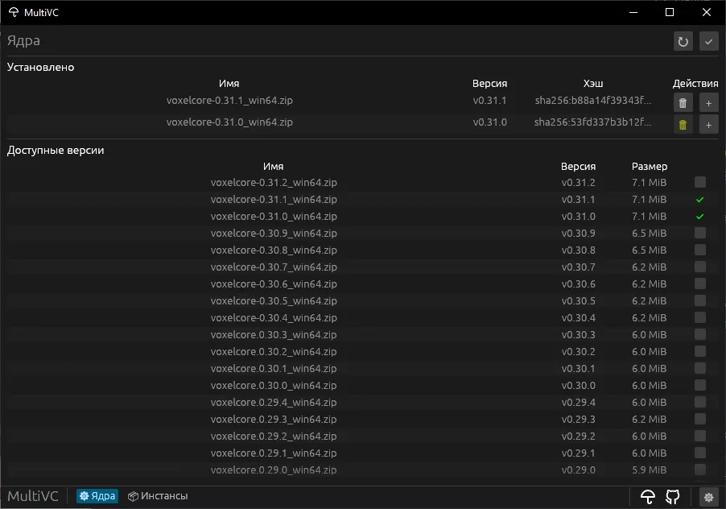
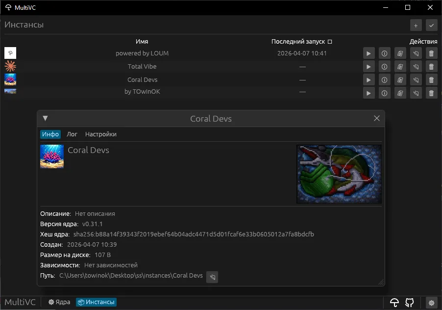
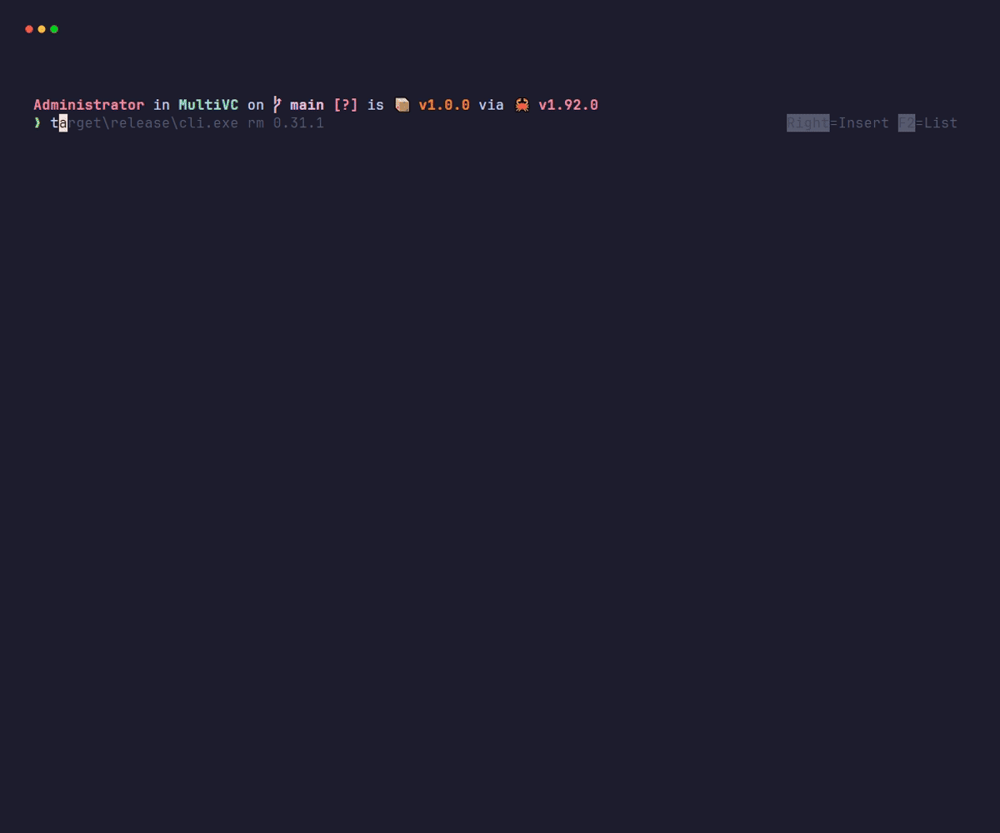

<p align="center">
  
</p>

<h1 align="center">MultiVC</h1>

<p align="center">
  Nix-like менеджер версий для VoxelCore
</p>

<p align="center">
  <a href="https://github.com/lost-umbrella-dev/MultiVC/actions/workflows/ci.yml"></a>
  <a href="LICENSE-MIT"></a>
</p>

<p align="center">
  <a href="README.en.md">English</a>
</p>

---

MultiVC управляет ядрами VoxelCore как зависимостями: каждая версия ядра устанавливается один раз, а инстансы (игровые миры) ссылаются на нужную версию по хэшу. Приложение полностью portable — при запуске создаются только локальные папки `cores/`, `instances/` и файл `settings.toml` (GUI), без записи в реестр или глобальные конфиги.

Доступно в двух вариантах: **GUI** (egui) и **CLI** (clap). Оба делают одно и то же — управление ядрами, создание инстансов, запуск игры.

## Скриншоты

| Cores | Instances |
|:-----:|:---------:|
|  |  |

<p align="center">
  
</p>

## Возможности

- Установка и обновление версий VoxelCore из GitHub Releases
- Управление инстансами — отдельные конфигурации, зависимости, запуск
- Валидация целостности файлов (SHA-256)
- Параллельная загрузка с отображением прогресса
- Запуск и остановка инстансов из GUI и CLI
- i18n — русский и английский интерфейс (GUI)

## Как это работает

MultiVC создаёт portable структуру рядом с исполняемым файлом:

```
multivc
├── cores/                # установленные версии ядра
│   ├── lock.toml         # реестр: хэш → версия, timestamp
│   └── sha256:a1b2c3…/   # папка конкретной версии
│       ├── core.exe       # исполняемый файл (Windows)
│       └── res/           # ресурсы движка
├── instances/            # игровые миры
│   ├── lock.toml         # реестр: имя → метаданные (иконка, баннер)
│   └── my_world/         # папка инстанса
│       └── instance.toml # конфиг: ядро (хэш), описание, зависимости
└── settings.toml         # настройки GUI (язык)
```

Ядра — это зависимости. Инстанс ссылается на ядро по хэшу. Удалить ядро, пока на него ссылается хотя бы один инстанс, нельзя.

## Платформы

| Tier | Платформа | Статус |
|------|-----------|--------|
| 1    | Windows   | Полная поддержка |
| 2    | Linux     | Поддерживается |
| 3    | macOS     | Ограниченная (ограничения VoxelCore) |

## Установка

Готовые бинарники на странице [Releases](https://github.com/lost-umbrella-dev/MultiVC/releases).

## Быстрый старт (CLI)

```bash
multivc install 0.31.1       # Установить ядро
multivc ls                   # Список установленных ядер
multivc fetch                # Доступные версии с GitHub

multivc new my_world 0.31.1  # Создать инстанс
multivc instances            # Список инстансов
multivc launch my_world      # Запустить игру

multivc check                # Проверить целостность
multivc rm 0.31.1            # Удалить ядро
```

## Сборка из исходников

Требования: [Rust](https://www.rust-lang.org/tools/install) (stable)

```bash
git clone https://github.com/lost-umbrella-dev/MultiVC.git
cd MultiVC
cargo build -p gui --release   # GUI
cargo build -p cli --release   # CLI
```

Бинарники в `target/release/`.

## Лицензия

[MIT](LICENSE-MIT) OR [Apache-2.0](LICENSE-APACHE)
